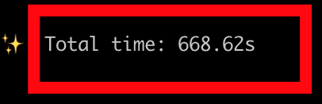
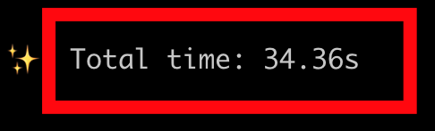

# Lambda+AppConfig Integration

Lambda+AppConfig integration is easy to use. Amazon provides Lambda Layers to implement the integration!
With AppConfig, you can store application configuration such as feature flags.
This integration makes it simple to retrieve application configuration in your Lambdas.
Checkout the AWS documentation
here [AWS Lambda AppConfig docs](https://docs.aws.amazon.com/appconfig/latest/userguide/appconfig-integration-lambda-extensions.html).


# Overview

- IaC in AWS CDK
- DevOps tooling and makefile configuration
- Lambda+AppConfig integration using Amazon provided Lambda layers
- Solution deploys to LocalStack and includes an integration test
- Solution deploys to AWS using the same IaC

## LocalStack Requirements

- LocalStack Pro subscription
- LocalStack Extension for Lambda+AppConfig. Contact LocalStack for details.

## Tooling Requirements with GDC

- Docker or DockerDesktop
- Install/clone the GDC (Generic Dev Container) [here](https://github.com/devxpod/GDC). We'll refer to this cloned
  directory as `GDC_HOME`.

## Setup with GDC

Set `GDC_HOME`

```shell
export GDC_HOME=<path to clone GDC repo>
```

### Configure LocalStack Auth

Starting the GDC starts LocalStack and a dev container.
Add a file to the root of this project called `.env-gdc-local` and put either your LocalStack API key in it
or your LocalStack Auth Token in it. This file is in `.gitignore` and not tracked.
Contents to look like this:

```shell
export LOCALSTACK_AUTH_TOKEN="<your auth token>"
# OR
export LOCALSTACK_API_KEY="<your API key>"
```

### Start the GDC + LocalStack

From the root directory of this cloned project.

```shell
${GDC_HOME}/run-dev-container.sh
```

### Deploy LocalStack Lambda+AppConfig Extension

Contact LocalStack for details.
Example install from your host computer.

```shell
export LOCALSTACK_VOLUME_DIR=<path to project>/lambda-appconfig-apigwv2/ls_volume
localstack extensions -v install file://<path to extension>/localstack-extension-lambda-appconfig-0.1.0.tar.gz
```

### Get into GDC shell

Unless otherwise stated, do all commands from within a GDC shell.

```shell
docker exec -it lappc-dev-1 bash -l
```

Restart LocalStack so it will load the LocalStack Extension on startup.

```shell
make restart-ls
```

# Deploy to LocalStack

## Deploy with AWS CDK to LocalStack

### Bootstrap AWS CDK Stacks on LocalStack

You need to do this once.

```shell
make local-awscdk-bootstrap
```

### Deploy App Stack on LocalStack

This will deploy the resources.

```shell
make local-awscdk-deploy
```

### Curl APIGW Url

```shell
make local-awscdk-invoke
```

### Run test

This will run the integration test asserting the Lambda AppConfig and DynamoDB integrations work.

```shell
make local-awscdk-test
```

### Cleanup and restart LocalStack

```shell
make local-awscdk-clean restart-ls
```

# Deploy to AWS

We use the same IaC pipelines to deploy to AWS! This is a very important point that LocalStack enables teams
to test their IaC pipelines locally before ever deploying them to a live AWS environment.

Do this from your host machine. Not inside the GDC.

Install AWS `cdk`

```shell
npm install -g aws-cdk
```

## Set Live AWS Credentials

However you set your credentials in your terminal, do it now.

### Deploy the AWS CDK IaC App Stack

Bootstrap the account. Only need to do this once per account/region.

```shell
make sbx-awscdk-bootstrap
```

This will deploy the resources.

```shell
make sbx-awscdk-deploy
```

### Invoke the Lambda in AWS

```shell
make sbx-awscdk-invoke
```

### Destroy the CDK Stack in AWS

```shell
make sbx-awscdk-destroy
```

# LocalStack DevX

With LocalStack, you can iterate quickly with an Amazing DevX.
The deployment of this solution to AWS takes **11 minutes**. The deployment of this solution
to LocalStack takes **34 seconds**.



