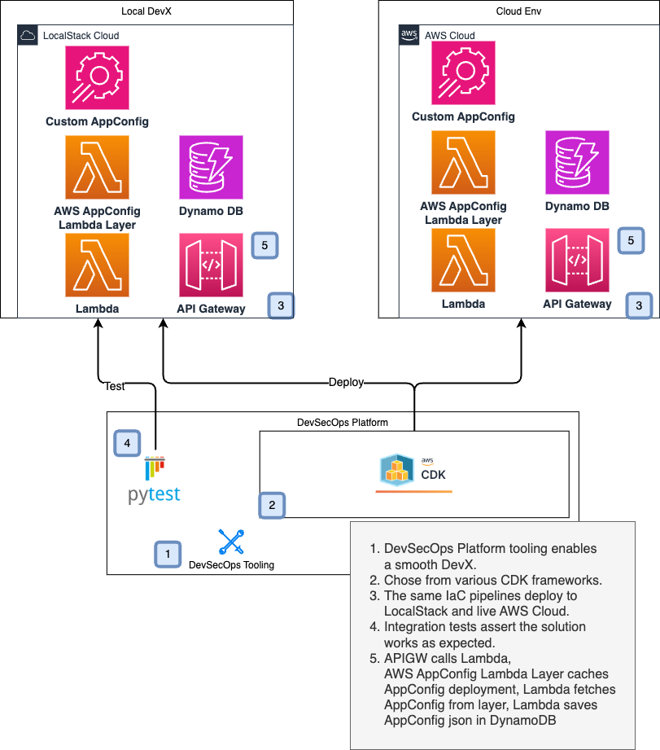

# Lambda+AppConfig Integration

Lambda+AppConfig integration is easy to use. Amazon provides Lambda Layers to implement the integration!
With AppConfig, you can store application configuration such as feature flags.
This integration makes it simple to retrieve application configuration in your Lambdas.
Checkout the AWS documentation
here [AWS Lambda AppConfig docs](https://docs.aws.amazon.com/appconfig/latest/userguide/appconfig-integration-lambda-extensions.html).



# Overview

- IaC in AWS CDK
- DevOps tooling and makefile configuration
- Lambda+AppConfig integration using Amazon provided Lambda layers
- Solution deploys to LocalStack and includes an integration test
- Solution deploys to AWS using the same IaC

## LocalStack Requirements

- LocalStack Pro subscription
- LocalStack Extension for Lambda+AppConfig

## Tooling Requirements with GDC

- Docker or DockerDesktop
- Install/clone the GDC (Generic Dev Container) [here](https://github.com/devxpod/GDC). We'll refer to this cloned
  directory as `GDC_HOME`.

## Tooling Requirements without GDC

- Docker or DockerDesktop
- Make
- Python 3.11+
- NVM (node version manager). Use version 18.
- ... ...

## Setup with GDC

### Configure LocalStack Auth

Starting the GDC starts LocalStack and a dev container.
Add a file to the root of this project called `.env-gdc-local` and put either your LocalStack API key in it
or your LocalStack Auth Token in it. This file is in `.gitignore` and not tracked.
Contents to look like this:

```shell
export LOCALSTACK_AUTH_TOKEN="<your auth token>"
# OR
export LOCALSTACK_API_KEY="<your API key>"
```

### Start the GDC + LocalStack

From the root directory of this cloned project.

```shell
${GDC_HOME}/run-dev-container.sh
```

### Deploy LocalStack Lambda+AppConfig Extension

Contact LocalStack for details.
Example install from your host computer.

```shell
export LOCALSTACK_VOLUME_DIR=<path to project>/lambda-appconfig-apigwv2/ls_volume
localstack extensions -v install file://<path to extension>/localstack-extension-lambda-appconfig-0.1.0.tar.gz
```

Restart the GDC so LocalStack will load the LocalStack Extension on startup.

# Deploy

## Open the GDC (Generic Dev Container)

```shell
docker exec -it lappc-dev-1 bash -l
```

### Install `cdklocal`. See [LocalStack CDK CLI](https://docs.localstack.cloud/user-guide/integrations/aws-cdk/)

```shell
npm install -g aws-cdk-local aws-cdk
```

## Deploy with AWS CDK to LocalStack

### Bootstrap AWS CDK Stacks on LocalStack

You need to do this once.

```shell
make local-awscdk-bootstrap
```

### Deploy App Stack on LocalStack

This will deploy the resources.

```shell
make local-awscdk-deploy
```

### Run test

This will deploy the resources.

```shell
make local-awscdk-test
```

